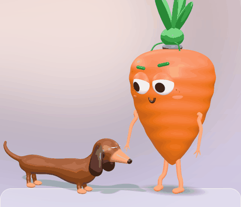
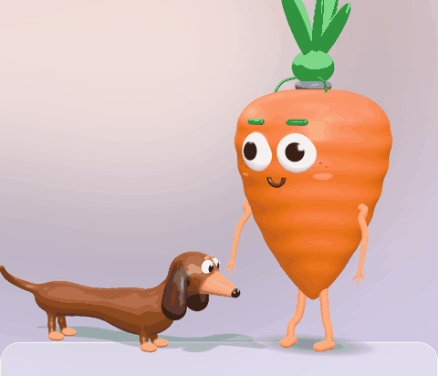

# carroto 🥕

**An AI desktop pet that lives on your Mac dock — with his dog, Dig.**

carroto walks along your dock, does yoga, naps, and chats with you through the AI coding tool you already use
(Claude Code, Codex or Gemini CLI). He can keep an eye on your AI tools too: when Claude Code needs a permission,
he pops up so you can allow it, and he tells you which chat just finished.

His dachshund, Dig, trots after him, catches the biscuits carroto drops him, rolls on his back, chases his tail,
and joins in with the yoga (downward dog, obviously).

  
  
  

## Get him

1. Download **carroto.zip** from [Releases](../../releases/latest) and unzip it.
2. Drag **carroto.app** into your Applications folder.
3. Open it. The first time, macOS will say it can't check the app (it isn't from the App Store), so either:
   - **right-click carroto.app → Open → Open**, or, on newer macOS,
   - open it once, then go to **System Settings → Privacy & Security** and click **Open Anyway**, or
   - in Terminal: `xattr -dr com.apple.quarantine /Applications/carroto.app`

macOS 14 or later, Apple silicon or Intel.

## What he does

- **lives on your dock**: walks about, stands around breathing, waters his plant, does yoga, takes naps.
  Pick him up and drop him somewhere else; he lands on his feet (mostly).
- **chats with you**: click him. He talks through **Claude Code**, **Codex** or **Gemini CLI** (also Copilot CLI,
  OpenCode and OpenClaw), whichever you have installed and signed in. No API keys go into carroto.
  With Claude Code he's carroto, and he can only search and read the web. The other tools run the way
  lil agents runs them: in your home folder with their auto-approve mode on (Codex `--full-auto`, Gemini
  `--yolo`, Copilot `--allow-all`), so they can edit files there. Pick Claude Code if you'd rather he couldn't.
- **watches your AI tools** (right-click → *watch my ai tools 👀*): when Claude Code asks for a permission he
  shows it with **allow / deny** right there on the dock, and when a long task is done he says which chat
  finished. Works with Claude Code, Codex, Cursor and Gemini CLI hooks. Your original settings are backed up and
  restored when you turn it off.
- **keeps you company**: a focus timer (25 or 50 minutes) that hides chatty apps, plus an optional DND mode;
  a lunch alarm; and when a video's playing he turns round with his popcorn and watches it with you.
- **has a dog**: Dig follows him, wags, lies down while carroto is busy, sleeps when he naps, does a trick every
  few minutes, and gets a biscuit every half hour or so.

Right-click carroto for his menu.

## Privacy

Everything stays on your Mac. Chats go through your own CLI and account. The tool watcher only listens on
`127.0.0.1`.

## Credits

- Built on [**lil agents**](https://github.com/ryanstephen/lil-agents) by Ryan Stephen (MIT): the dock-walking,
  agent-chat foundation carroto grew out of. Thank you!
- carroto and Dig are 3D characters made in [three.js](https://threejs.org) and rendered frame by frame into the
  little videos the app plays. Dig is sculpted like clay: soft shapes blended into one surface (signed distance
  fields + surface nets), with floppy physics ears.
- Fonts: Bricolage Grotesque and Gochi Hand, under the SIL Open Font License (see [FONTS-LICENSE.txt](FONTS-LICENSE.txt)).
- Made with [Claude](https://claude.ai).

Follow his adventures: **[@agentcarroto](https://www.instagram.com/agentcarroto)** on Instagram.

## License

MIT, see [LICENSE](LICENSE).
